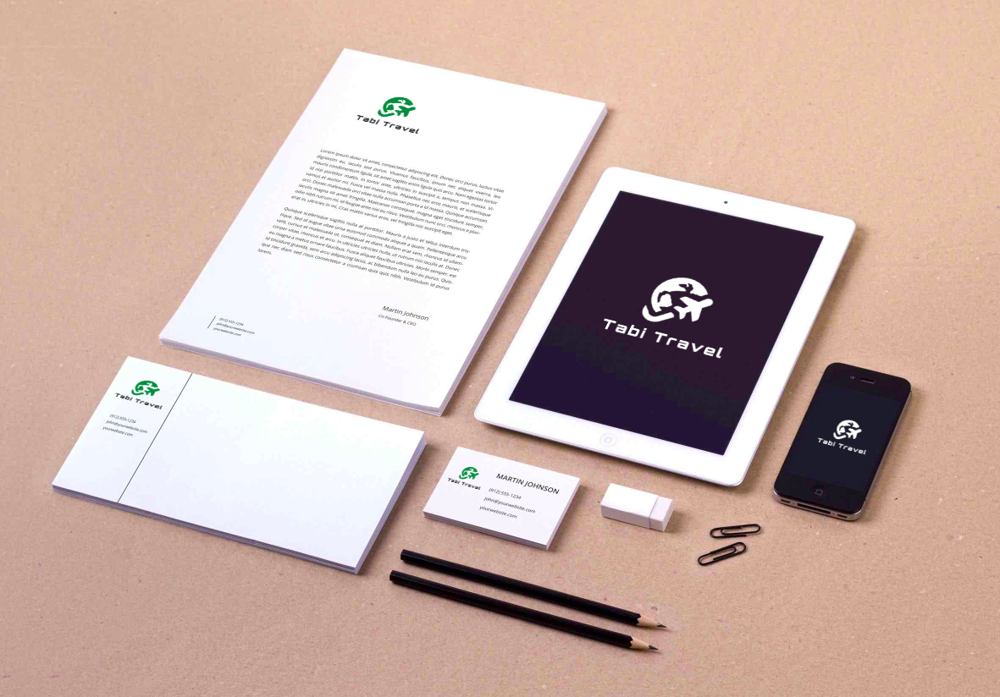

# DIU - Práctica 3

## Paso 3. Mi equipo UX-Case Study

 3.a ¿Como se cuenta un UX-Case Study?
-----

En primer lugar, quiero reflejar un pensamiento que he tenido en varias ocasiones durante la lectura del blog propuesto, y es que se nota que este UX Case Study está realizado por un equipo de 3 personas con un conocimiento de la materia, y que han empleado una metodología ágil de sprint en la que se dedican a este proyecto al 100% durante dos semanas.

Entrando ya en las metodologías, en la fase inicial me ha llamado especialmente la atención la profundidad del análisis de la competencia que hacen, mostrando los puntos que incluye y los que no diversas apps que tienen una funcionalidad similar. También me ha llamado especialmente la atención el mapa de empatía que realizan, ya que aunque es una técnica que vimos en clase de teoría, no es una técnica que utilizamos finalmente en nuestro caso práctico.

Esta técnica enlaza directamente con la siguiente utilizada y la que más me ha llamado la atención, y es que antes de diseñar personas ficticias, realizan una entrevista a usuarios junto con un mapa de afinidad para localizar los comportamientos más comunes entre los usuarios que pueden afectar a la aplicación.

A continuación vemos que crean dos personas ficticias y usan los mismos métodos que hemos utilizado nosotros (o métodos similares) como User Journey Maps o Experiencie Maps.

Finalmente, vemos que entran en una fase de diseño y desarrollo, asemejándose la parte de diseño a la que nosotros hemos realizado. Me ha llamado la atención el cómo durante todo este proceso van realizando varias iteraciones que intercalan prototipos, primero en papel y más tarde en formato digital, y testeaos de los mismos. Otra cosa que me ha llamado la atención es que realizan el sitemap casi al final del proceso de diseño.

  3.b Imagotipo
----

Para el diseño del Imagotipo se ha usado una herramienta de edición online llamada Photopea disponible en: https://www.photopea.com/

Por una parte tenemos el Isotipo, compuesto por un avión girando alrededor de una figura que recuerda a la Tierra. Utiliza el color verde especificado en la guía de estilo, pero al ser plano, permite variaciones de otros colores, blanco y negro o blanco con el fondo oscuro. De nuevo, al ser un logotipo plano, facilita que sea reconocible, ya que no pierde detalle alguno al cambiarlo de color, con una silueta reconocible.

Por otra parte tenemos el Logotipo, siendo las palabras "Tabi Travel", nombre de la app. Utiliza utiliza el color gris definido en la guía de estilo "Lustra Book" como tipografía, una tipografía no libre y de pago. Cuenta con las mismas ventajas que el Isotipo en cuanto a la facilidad para reconocer las letras independientemente del color que se use.

Finalmente, el Imagotipo es la composición de los dos elementos anteriores.

Podemos ver algunos ejemplos de aplicación del Imagotipo a continuación:

 3.c Guidelines
----

#### Tipografía y colores

Por una parte, se ha escogido la tipografía "[Open Sans](https://fonts.google.com/specimen/Open+Sans)" en tres de sus variantes,  "Regular", "Semibold" y "Bold". Esta tipografía es completamente libre y gratuita que se encuentra bajo la licencia [Apache License, Version 2.0](http://www.apache.org/licenses/LICENSE-2.0). Es una tipografía amigable, especialmente legible y optimizada tanto como para impresión como para utilizarla en dispositivos móviles o en formato web.

Por otra parte, se han usado cuatro colores, siendo el verde con código #007C3F el color principal, como color secundario el rojo con código #7C3634, y auxiliares un tono gris con código #342F28 y el color blanco #FFFFFF.

#### Patrones de diseño

Investigando sobre patrones de diseño, he podido encontrar [Material Design](https://material.io/), un sistema de diseño *open-source*, que nos introduce una manera sencilla de entrar en el mundo del diseño de aplicaciones.

Nos aporta una serie de herramientas como:

- Pautas de diseño, que incluyen desde detalles de estilo hasta buenas práctica.
- Guía de componentes, que nos permite crear una interfaz de usuario sencilla y bonita, tanto para dispositivos móviles como para formato Web.
- Acceso a multitud de iconos.
- Pautas para hacer accesible nuestra aplicación, ayudándonos a crear una aplicación en la que a los usuarios les sea sencillo navegar, entender y usar nuestra interfaz.

---

  3.d Video
----

Se ha desarrollado un vídeo sencillo explicando el proceso y las técnicas utilizadas para el desarrollo de este proyecto. Se encuentra disponible [aquí]().

---

  3.d Valoración y conclusiones
----

Con el desarrollo de estas prácticas, he aprendido diversas técnicas y herramientas para ya no solo analizar el diseño de una web o aplicación ya creada, si no todo el proceso que se sigue para poder ponernos en la piel del usuario.

Me ha servido especialmente el caso de MuseMap, ya que me ha facilitado el ver la importancia de los distintos pasos a seguir y la utilidad de la información que obtenemos con cada uno de ellos.

Valoro la experiencia como positiva, a excepción del apartado de realizar el vídeo que me ha resultado duro de realizar por una parte por el intento de vender un producto que se encuentra en fase de desarrollo y por otra parte, siendo exclusivamente esta segunda culpa mía, por encontrarme en un estado anímico malo y en una situación de estrés y ansiedad.

Quiero agradecer a ambos profesores, Miguel y Rosana, el esfuerzo extra que habéis puesto a la asignatura para a pesar de la situación, atendernos con las mayores garantías posibles, dotarnos de la mayor cantidad posible de material y adaptar la asignatura con tanta presteza a la situación que nos ha tocado vivir.
