# TABI TRAVEL - UX Case study
Esto es el estudio de una caso de estudio para el desarrollo de una aplicación móvil que ayuda a encontrar viajes y compañeros de viaje alrededor de todo el mundo, utilizando el análisis de la Web [Trip Giraffe]( https://www.tripgiraffe.com/es/).

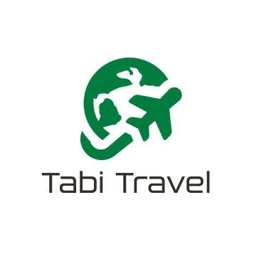

---

### Miembros del equipo
 * :bust_in_silhouette:  Guillermo Sandoval Schmidt - Estudiante de Ingeniería Informática en la UGR  
  - :octocat: [@Gsandoval96](https://github.com/Gsandoval96)

---

# Proceso de Diseño

## Paso 1. UX Desk Research & Analisis

 1.a Competitive Analysis
---

Entre las aplicaciones propuestas, las que nos han llamado más la atención han sido: Nomadizers, Trip Giraffe y Miss Travel, pero finalmente nos hemos decantado por Trip Giraffe ya que nos ha resultado la más llamativa de las tres.

---

 1.b Person
---

Hemos seleccionado un hombre y una mujer, cuyos perfiles contienen personalidades, experiencias y metas en la vida variadas para abarcar un público más diverso.

- Antonio García (policía nacional, 32 años)

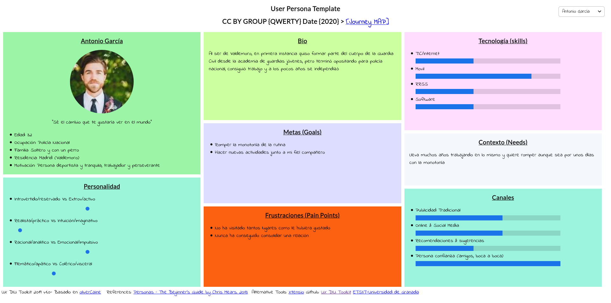

- Marian Henderson (estudiante de BBAA, 21 años)

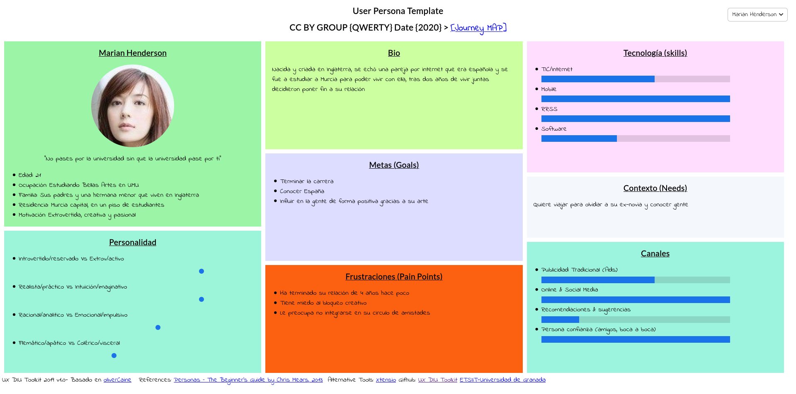

---

 1.c User Journey Map
----

Hemos escogido estos casos porque tienen una gran variedad de inconvenientes muy comunes que pueden surgir de cara a organizar un viaje, especialmente si es con gente desconocida. Entendemos que son experiencias de usuario relativamente comunes.

- Antonio García (viaje con animal de compañía)

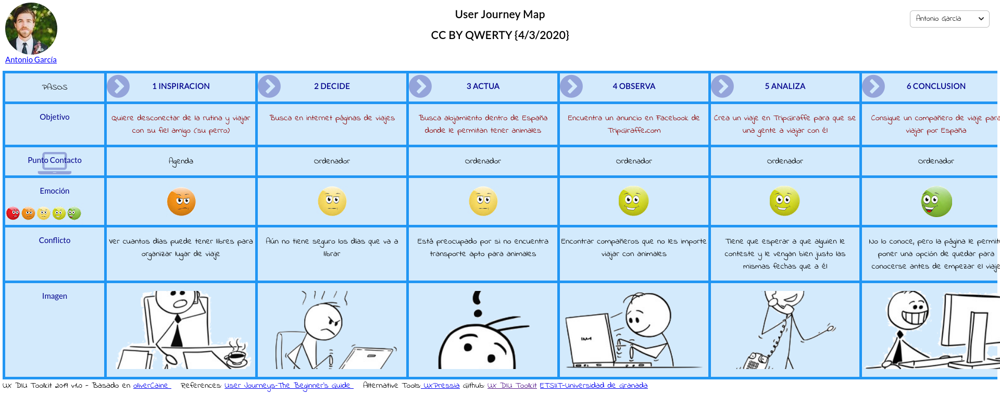

- Marian Henderson (viaje de estudiantes)

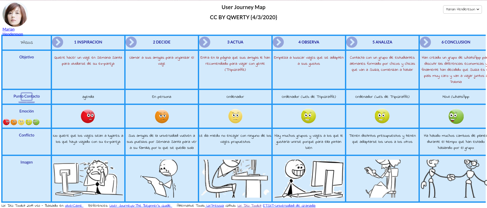

---

## Paso 2. UX Design  

 2.a Feedback Capture Grid
----

En primer lugar hemos realizado una tabla donde capturar los puntos fuertes de la web analizada, encontrar fallos de diseños y dudas que surgen al usarla y finalmente, encontrar nuevas ideas para el desarrollo de nuestra app.

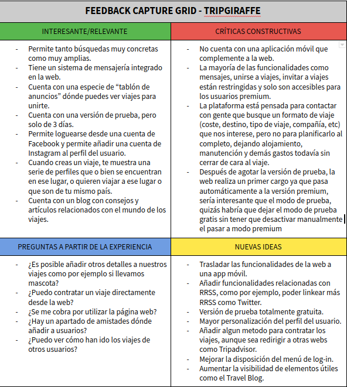

Se plantea desarrollar una app móvil que apoye a la página web, mejorando la usabilidad, integrando otras funcionalidades como integración de otras RRSS o enlaces a web para contratar viajes.

 2.b Tasks & Sitemap
-----

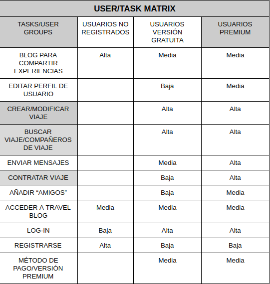

Se ha escogido el método de User/Task matrix ya que permite con un vistazo rápido distinguir los puntos críticos del sistema, pudiendo centrarse en el desarrollo de los mismos. Además, ayuda a diferenciar facilmente la importancia de las tareas en función del tipo de usuario.

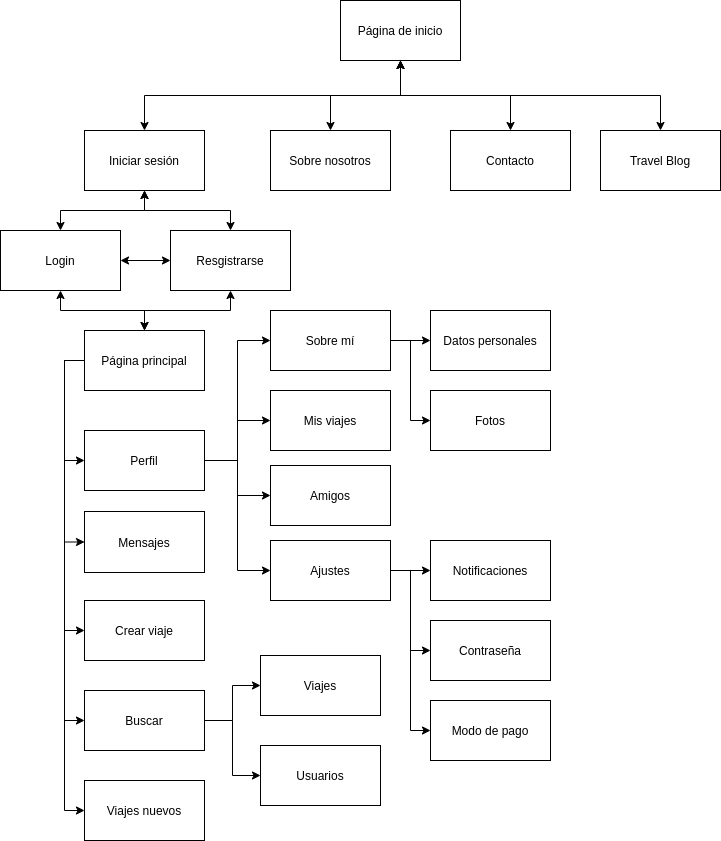

 2.c Labelling
----

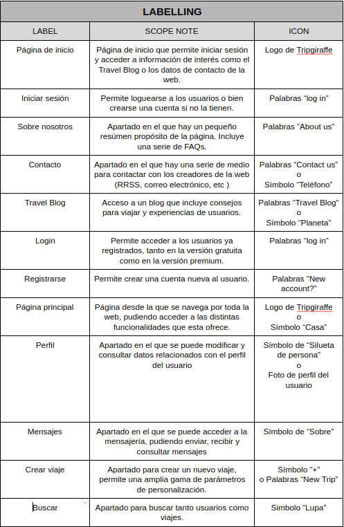

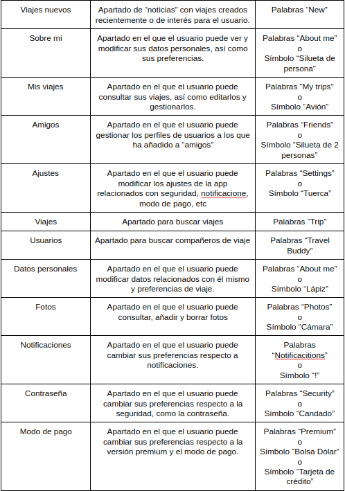

 2.d Wireframes
-----

Finalmente, se ha realizado un primer boceto de la aplicación final, siendo una versión "a papel".

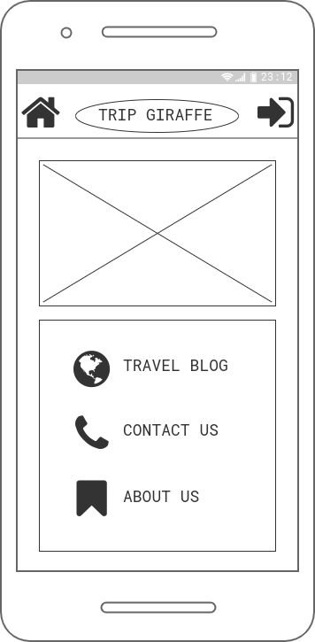

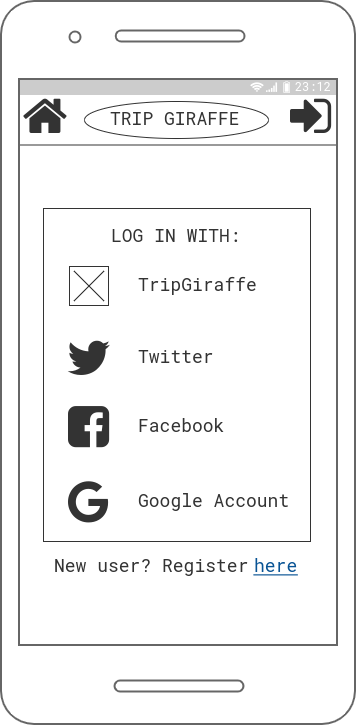

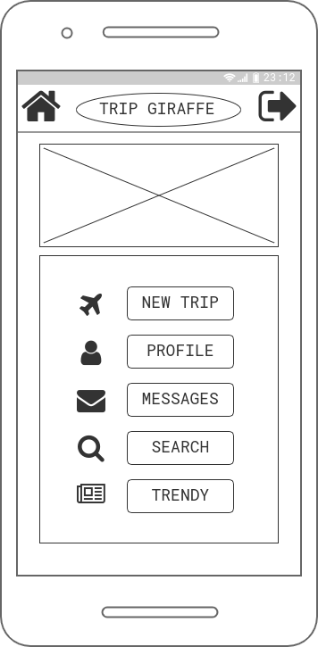

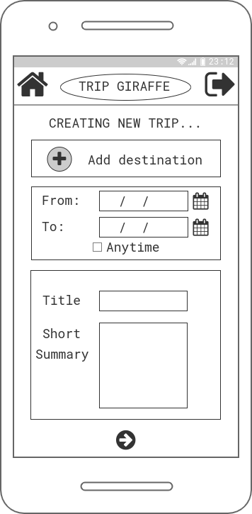

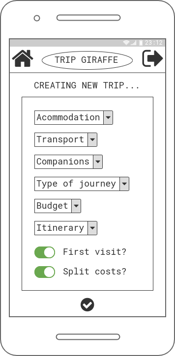

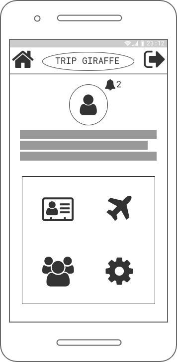

---------------------------------------------------------------------

## Paso 3. Diseño y propuesta de valor

  3.a Imagotipo
----

Para el diseño del Imagotipo se ha usado una herramienta de edición online llamada Photopea disponible en: https://www.photopea.com/

Por una parte tenemos el Isotipo, compuesto por un avión girando alrededor de una figura que recuerda a la Tierra. Utiliza el color verde especificado en la guía de estilo, pero al ser plano, permite variaciones de otros colores, blanco y negro o blanco con el fondo oscuro. De nuevo, al ser un logotipo plano, facilita que sea reconocible, ya que no pierde detalle alguno al cambiarlo de color, con una silueta reconocible.

Por otra parte tenemos el Logotipo, siendo las palabras "Tabi Travel", nombre de la app. Utiliza utiliza el color gris definido en la guía de estilo "Lustra Book" como tipografía, una tipografía no libre y de pago. Cuenta con las mismas ventajas que el Isotipo en cuanto a la facilidad para reconocer las letras independientemente del color que se use.

Finalmente, el Imagotipo es la composición de los dos elementos anteriores.

Podemos ver algunos ejemplos de aplicación del Imagotipo a continuación:

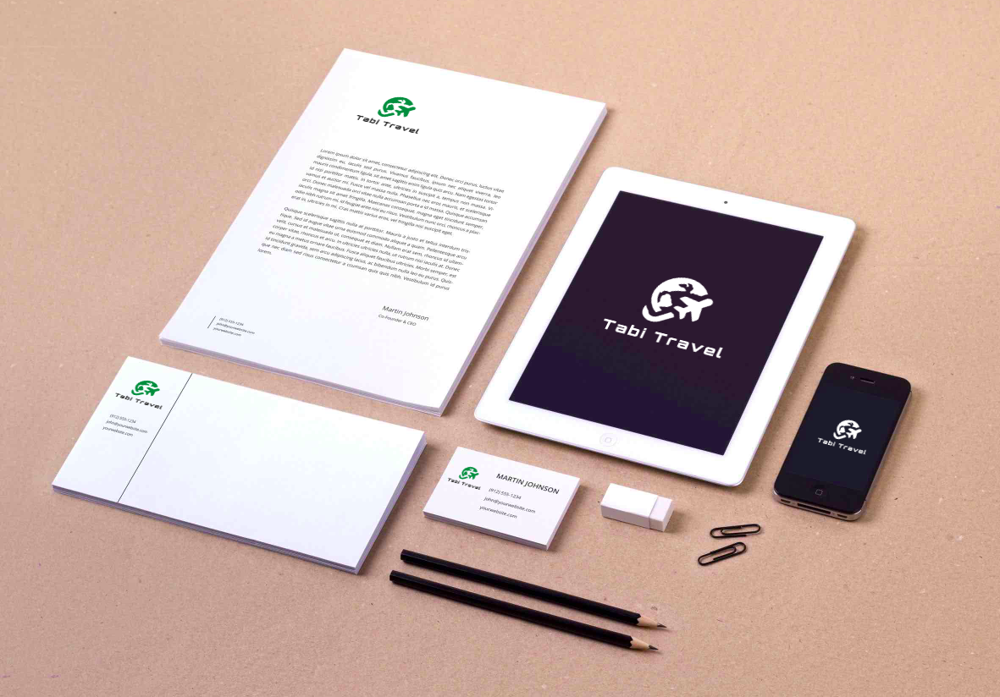

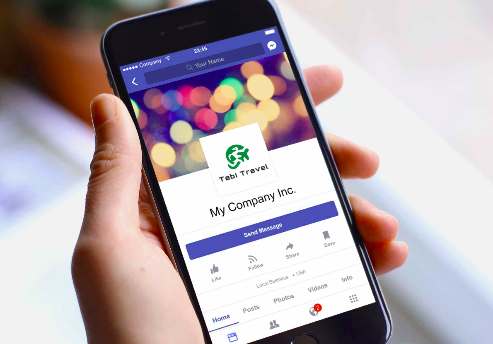

 3.b Guidelines
----

#### Guía de estilo

Por una parte, se ha escogido la tipografía "[Open Sans](https://fonts.google.com/specimen/Open+Sans)" en tres de sus variantes,  "Regular", "Semibold" y "Bold". Esta tipografía es completamente libre y gratuita que se encuentra bajo la licencia [Apache License, Version 2.0](http://www.apache.org/licenses/LICENSE-2.0). Es una tipografía amigable, especialmente legible y optimizada tanto como para impresión como para utilizarla en dispositivos móviles o en formato web.

Por otra parte, se han usado cuatro colores, siendo el verde con código #007C3F el color principal, como color secundario el rojo con código #7C3634, y auxiliares un tono gris con código #342F28 y el color blanco #FFFFFF.

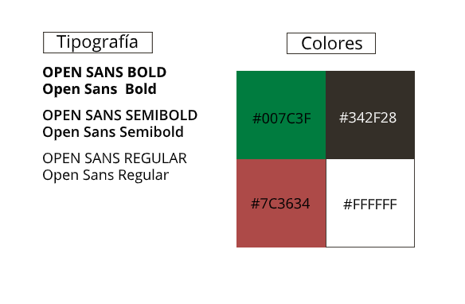

  3.d Propuesta de valor
----

>>> Documente y resuma el diseño de su producto en forma de video de 90 segundos aprox
