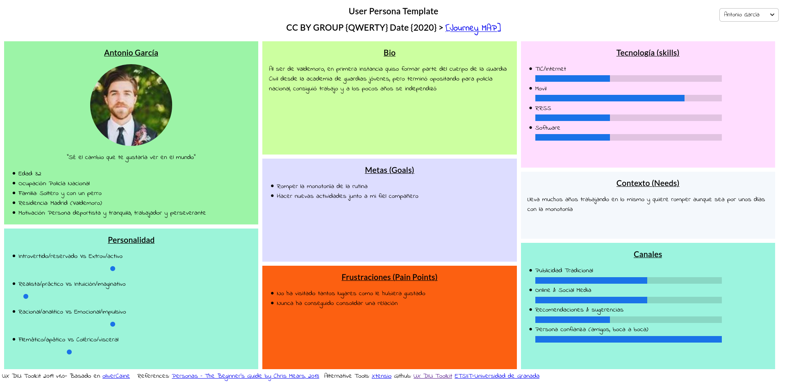
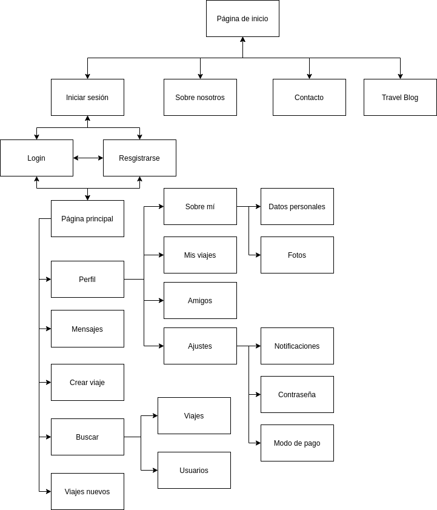
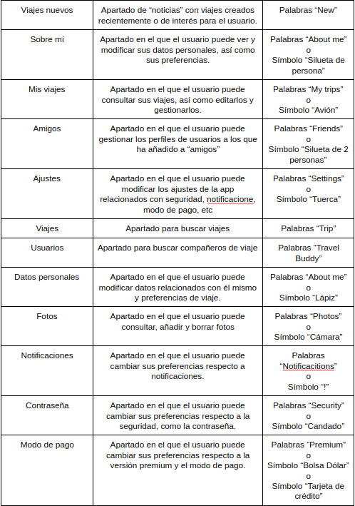
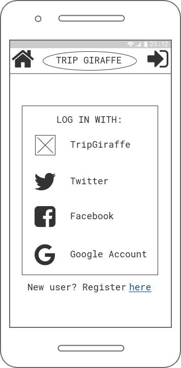
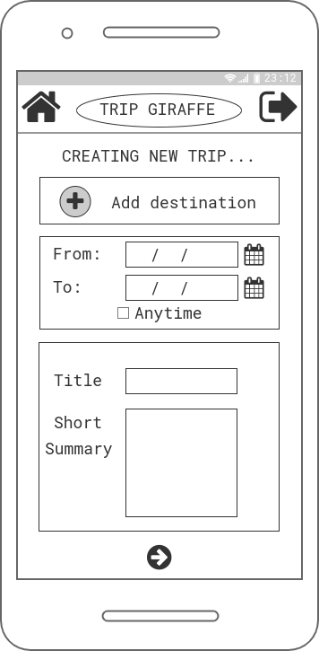
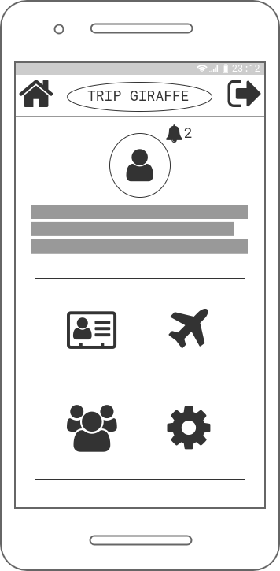
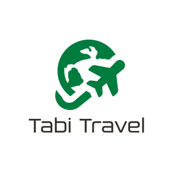
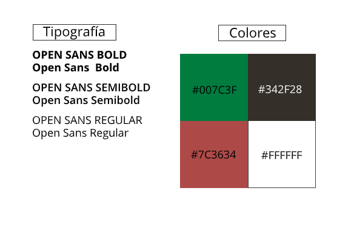

# DIU20
Prácticas Diseño Interfaces de Usuario 2019-20 (Economía Colaborativa)

Grupo: DIU1_QWERTY.  Curso: 19/20

Proyecto: Tabi Travel

Descripción: Aplicación móvil que ayuda a encontrar viajes y compañeros de viaje alrededor de todo el mundo.

Imagotipo: [TabiTravel](P3/LogoTabiTravel.png)

Miembros  
 * :bust_in_silhouette:  Guillermo Sandoval Schmidt     
  - :octocat: [@Gsandoval96](https://github.com/Gsandoval96)

-----

En esta práctica estudiaremos un caso de plataforma de economía colaborativa y realizaremos una propuesta para su diseño Web/movil. Utilizaremos herramientas y entregables descritos en el siguiente CheckList (https://github.com/mgea/UX-DIU-Checklist)

Qué es economía colaborativa: Martínez-Polo, J. (2019). **El fenómeno del consumo colaborativo: del intercambio de bienes y servicios a la economía de las plataformas**, *Sphera Publica, 1*(19), 24-46. http://sphera.ucam.edu/index.php/sphera-01/article/view/363/14141434

>>> Este documento es el esqueleto del report final de la práctica. Aparte de subir cada entrega a PRADO, se debe actualizar y dar formato de informe final a este documento online.

# Proceso de Diseño

## Paso 1. UX Desk Research & Analisis

 1.a Competitive Analysis
-----

>>> Entre las aplicaciones propuestas, las que nos han llamado más la atención han sido: Nomadizers, Trip Giraffe y Miss Travel, pero finalmente nos hemos decantado por Trip Giraffe ya que nos ha resultado la más llamativa de las tres.

---

 1.b Persona
-----

>>> Hemos seleccionado un hombre y una mujer, cuyos perfiles contienen personalidades, experiencias y metas en la vida variadas para abarcar un público más diverso.

- Antonio García (policía nacional, 32 años)

- Marian Henderson (estudiante de BBAA, 21 años)

---

 1.c User Journey Map
----

>>> Hemos escogido estos casos porque tienen una gran variedad de inconvenientes muy comunes que pueden surgir de cara a organizar un viaje, especialmente si es con gente desconocida. Entendemos que son experiencias de usuario relativamente comunes.

- Antonio García (viaje con animal de compañía)

- Marian Henderson (viaje de estudiantes)

---

 1.d Usability Review
----
>>>  Revisión de usabilidad:
>>> - Enlace al documento:  [Usability-Review](https://github.com/Gsandoval96/DIU20/blob/master/P1/Usability-review-Trip-Giraffe.pdf)
>>> - Valoración final (numérica): 80 - Good
>>> - Comentario sobre la valoración:  La valoración se asemeja con la realidad, ya que a pesar de contar con algunos fallos, la web cumple con su cometido y muestra la información de manera clara y sencilla.

---

## Paso 2. UX Design  

 2.a Feedback Capture Grid
----

>>> Comenta con un diagrama los aspectos más destacados a modo de conclusion de la práctica anterior,

>>> ¿Que planteas como "propuesta de valor" para un nuevo diseño de aplicación para economia colaborativa ?
>>> Problema e hipótesis
>>> (150-200 caracteres)

Se plantea desarrollar una app móvil que apoye a la página web, mejorando la usabilidad, integrando otras funcionalidades como integración de otras RRSS o enlaces a web para contratar viajes.

 2.b Tasks & Sitemap
-----

Se ha escogido el método de User/Task matrix ya que permite con un vistazo rápido distinguir los puntos críticos del sistema, pudiendo centrarse en el desarrollo de los mismos. Además, ayuda a diferenciar facilmente la importancia de las tareas en función del tipo de usuario.

 2.c Labelling
----

 2.d Wireframes
-----

---------------------------------------------------------------------

## Paso 3. Mi equipo UX-Case Study

 3.a ¿Como se cuenta un UX-Case Study?
-----

Comentario sobre *'MuseMap Street Art App — UX Case Study'* --> [P3/README.md](P3/README.md)

  3.b Imagotipo
----

Para el diseño del Imagotipo se ha usado una herramienta de edición online llamada Photopea disponible en: https://www.photopea.com/

Por una parte tenemos el Isotipo, compuesto por un avión girando alrededor de una figura que recuerda a la Tierra. Utiliza el color verde especificado en la guía de estilo, pero al ser plano, permite variaciones de otros colores, blanco y negro o blanco con el fondo oscuro. De nuevo, al ser un logotipo plano, facilita que sea reconocible, ya que no pierde detalle alguno al cambiarlo de color, con una silueta reconocible.

Por otra parte tenemos el Logotipo, siendo las palabras "Tabi Travel", nombre de la app. Utiliza utiliza el color gris definido en la guía de estilo "Lustra Book" como tipografía, una tipografía no libre y de pago. Cuenta con las mismas ventajas que el Isotipo en cuanto a la facilidad para reconocer las letras independientemente del color que se use.

Finalmente, el Imagotipo es la composición de los dos elementos anteriores.

Podemos ver algunos ejemplos de aplicación del Imagotipo a continuación:

 3.c Guidelines
----

#### Tipografía y colores

Por una parte, se ha escogido la tipografía "[Open Sans](https://fonts.google.com/specimen/Open+Sans)" en tres de sus variantes,  "Regular", "Semibold" y "Bold". Esta tipografía es completamente libre y gratuita que se encuentra bajo la licencia [Apache License, Version 2.0](http://www.apache.org/licenses/LICENSE-2.0). Es una tipografía amigable, especialmente legible y optimizada tanto como para impresión como para utilizarla en dispositivos móviles o en formato web.

Por otra parte, se han usado cuatro colores, siendo el verde con código #007C3F el color principal, como color secundario el rojo con código #7C3634, y auxiliares un tono gris con código #342F28 y el color blanco #FFFFFF.

-

  3.d Video
----

>>> Documente y resuma el diseño de su producto en forma de video de 90 segundos aprox

## Paso 4. Evaluación

 4.a Casos asignados
----

>>> Descripción de las asignaciones (3 UX Case Study) y enlace a  sus repositorios.

>>>> En la sección P4/readme.md se debe acceder además a sus respectivas hojas de evaluación y conclusiones

 4.b User Testing
----

>>> Seleccione a una de sus personas ficticias. Exprese las ideas de posibles situaciones conflictivas de esa persona en las propuestas evaluadas

. 4.c Ranking
----

>>> Concluya con un ranking de los casos evaluados

>>> Valoración personal

## Paso 5. Evaluación de Accesibilidad  

  5.a Accesibility evaluation Report
----

>>> Indica qué pretendes evaluar (de accesibilidad) y qué resultados has obtenido + Valoración personal

>>> Evaluación de la Accesibilidad (con simuladores o verificación de WACG)

## Conclusión final / Valoración de las prácticas

>>> (90-150 palabras) Opinión del proceso de desarrollo de diseño siguiendo metodología UX y valoración (positiva /negativa) de los resultados obtenidos  
